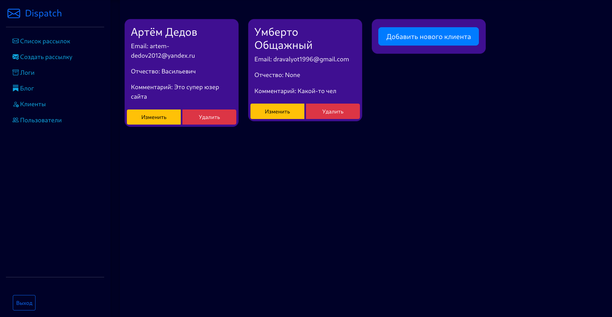
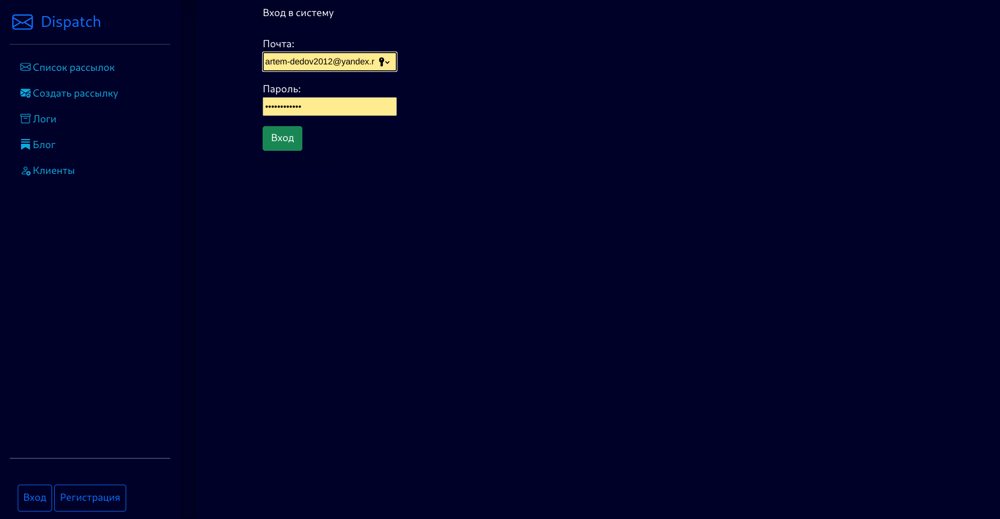

# Dispatch

## Описание

Этот проект представляет собой веб-приложение для управления рассылками, блогом и кэшированием данных. Основная
навигация представлена через боковое меню, включающее в себя следующие разделы:

## Функциональности

### Управление Рассылками

- Создание, чтение, обновление и удаление рассылок (CRUD)
- Скрипт рассылки для отправки сообщений по расписанию или из командной строки на почту клиентов
- Настройка конфигурации для периодического запуска задач
- Обработка ошибок внешнего сервиса при отправке сообщений

### Логика Рассылки

При создании новой рассылки проверяется текущее время:

- Если текущее время находится в диапазоне между временем начала и окончания рассылки, из справочника выбираются все
  клиенты, указанные в настройках рассылки. Затем запускается отправка сообщений для всех этих клиентов.
- Если время начала рассылки наступит в будущем, отправка сообщений автоматически начнется по наступлению этого времени,
  без необходимости дополнительных действий от пользователя системы.
- В процессе отправки сообщений система собирает статистику по каждому сообщению для последующего формирования отчетов.
  Эта статистика включает информацию о статусе отправки, ответах от почтовых серверов и другие данные, подробнее
  описанные в разделе "Логи".

### Интерфейс приложения

- **Список Рассылок:** Переход на страницу со списком всех рассылок

- **Создать Рассылку:** Создание новой рассылки

- **Логи:** Переход на страницу с журналом логов рассылок

- **Клиенты:** Переход на страницу с информацией о клиентах сервиса

- **Пользователи:** Переход на страницу управления пользователями приложения

### Блог

- Раздел для создания и публикации статей для продвижения сервиса

### Регистрация по Почте и Подтверждение

- Реализована регистрация пользователей по электронной почте с последующим подтверждением через почту

### Логирование на сайте

Авторизация является важной частью функционала данного сайта. Без надлежащего логирования функционал сайта может быть
недоступен или работать некорректно. Логи позволяют отслеживать действия пользователей, ошибки в системе и другие
события, что обеспечивает более стабильную и безопасную работу приложения.

### Кэширование

- Использование кэширования для оптимизации времени работы приложения

### Фронтенд

Фронтенд данного проекта разработан с использованием следующих технологий:

- **HTML:** Для структурирования содержимого веб-страниц
- **CSS:** Для стилизации и оформления внешнего вида элементов на странице
- **Bootstrap:** Использован для создания отзывчивого и стильного пользовательского интерфейса
- **JavaScript (JS):** Для добавления интерактивности и функциональности на стороне клиента

Эти технологии в совокупности обеспечивают удобный, эстетичный и функциональный пользовательский интерфейс.

### Зависимости

Все необходимые зависимости для этого проекта указаны в файле `requirements.txt`. При использовании VPN могут возникнуть
проблемы с работой рассылок из-за использования SMTP яндекса для отправки сообщений. Пользователи могут использовать
свой собственный SMTP-сервер при желании.

### Интегрированная среда разработки

Этот проект был полностью разработан с использованием PyCharm Professional, интегрированной среды разработки (IDE) от
JetBrains. PyCharm обеспечивает удобную среду для написания, отладки и управления проектами на языке Python,
предоставляя широкий набор инструментов для повышения производительности разработчика.
